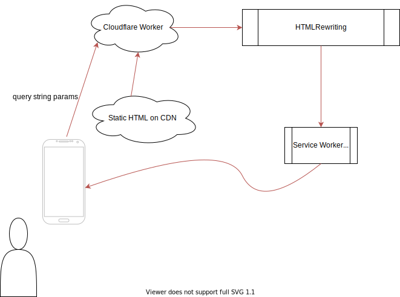

# xodus [WIP]

xodus transforms HTML as it leaves the server and travels to the promised land of the end user's browser.

It is used to add dynamic content to declarative web components, defined as HTML, served via text/html and/or text/plain mime type, accessible via a CDN url.  Many important, useful web components consist of 99% HTML / CSS / JSON, 1% JavaScript.  But strategically weaving in dynamic content into the web component before it arrives in the browser can provide a more satisfying initial view. 

[Flow](./xodus.svg)

xodus accomplishes this by providing helper classes that build on [CloudFlare's HTMLRewriter](https://developers.cloudflare.com/workers/runtime-apis/html-rewriter).

Hopefully native browser service workers will support something [similar](https://discourse.wicg.io/t/proposal-support-cloudflares-htmlrewriter-api-in-workers/5721)  eventually, which would allow weaving in data held in local storage, for example.

Its syntax is specific (but extendable) for components that use the may-it-be family of element behaviors/decorators to achieve binding, beginning with [be-definitive](https://github.com/bahrus/be-definitive).

Name inspired by this [funny comment](https://twitter.com/davatron5000/status/1312955820137754624).

Usefulness of this project should grow if, W3C willing, something like [templ-mount](https://github.com/bahrus/templ-mount) is built into the platform.

xodus follows an Edge of Tomorrow pattern:

1.  Every static resource reference is versioned, so coherent caching is possible.
2.  It is useful to think of the generation of HTML in 4 phases, which break down into two pairs of (nearly) isomorphic processing:
    1.  Out of the main thread:
        1.  On the Edge, in a cloudflare worker (or dino or node service) modeled after Service Workers.
        2.  In a browser service worker.
    2.  On the main thread:
        1.  In a template in the browser, during template instantiation, which can share code with:
        2.  In the live DOM tree
3.  Multi-layer declarative redundancy.  The same declarative syntax is used and potentially supported in all 4 layers above.  Where the syntax refers to external resources (including library JS references), each of the first three layers can either:
    1.  See if the external resource is in cache, and if so, perform the instructions found in the declarative syntax.
    2.  If not, "punt" and let the next layer handle it.
    3.  In the case of non static resources, impose a timeout on the request, and if it times out, punt to the next layer.
    4.  If a layer "punts" on embedding a static resource due to it not being in cache, nevertheless, in the background, retrieve the resource for the next time.
    5.  The last layer, the live DOM tree, is stuck with no choice but to perform the needed task if all other layers had to punt.  Ideally, this will only happen "once" per browser, "once" per cloud node, etc.

One particularly difficult area to optimize has to do with whether to embed external resources within the original payload, for the benefit of initial paint metrics, vs linking to them, which is better for fine-grained caching and lazy loading.

If the cloud function can "guess" what is in the cache based on visitor counts, it could embed the first time, link on subsequent times after the cache has been installed.  Who knows, maybe this functionality is built into web bundles?

